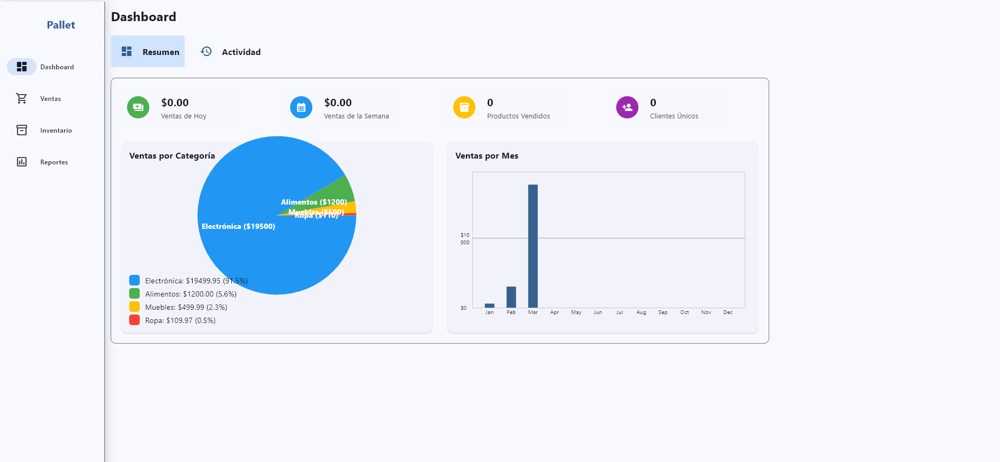
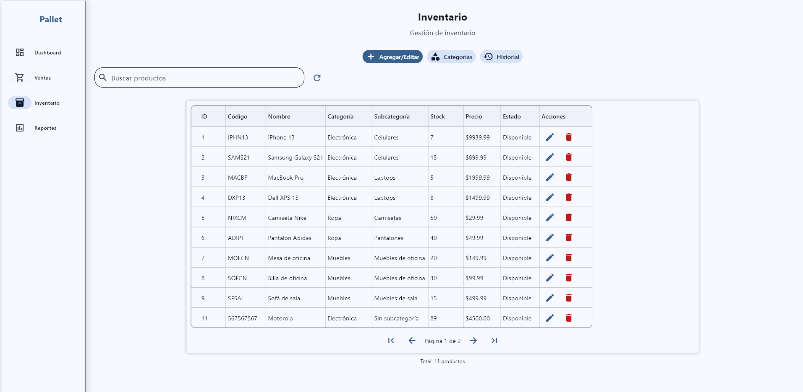
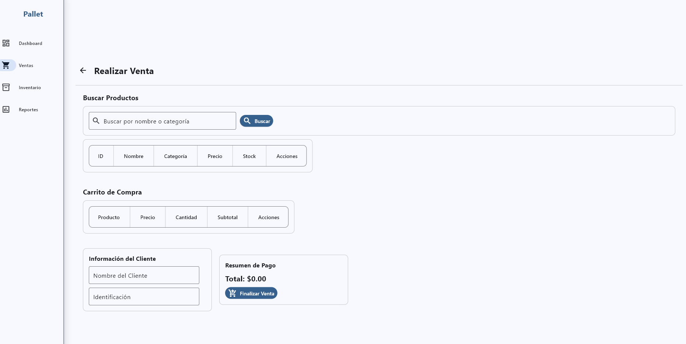
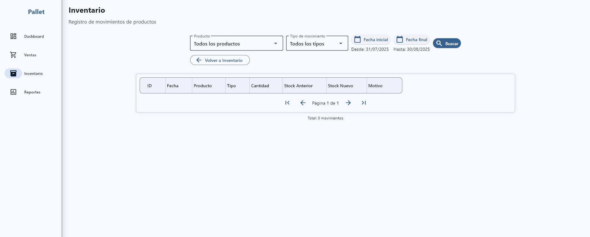

# Sistema de Ventas e Inventario (Python + Flet + SQLite)

Aplicación de escritorio responsiva para gestionar ventas, inventario, productos, categorías, clientes y proveedores. Orientada a PyInstaller/Flet Pack para distribución en Windows.

## Resumen 

- App de escritorio responsiva (Python 3, Flet, SQLite) con módulos de ventas, inventario con historial, clientes/proveedores y reportes.
- Arquitectura por capas: datos (`models`), negocio (`services`), UI (`pages`), persistencia y sesión (`database`).
- Autenticación (login/registro/restablecimiento), flujo de venta end-to-end con ítems y auditoría de stock.
- Setup automatizado (init de BD, credenciales seed) y empaquetado .exe con Flet Pack.

## Capturas (coloca tus imágenes)

- Login (coloca aquí login.png → assets/screenshots/login.png)

- Dashboard/Resumen (coloca aquí dashboard.png → assets/screenshots/dashboard.png)
    
- Gestión de productos (coloca aquí products.png → assets/screenshots/products.png)
    
- Flujo de venta y comprobante (coloca aquí sale.png → assets/screenshots/sale.png)
    
- Inventario e historial (coloca aquí inventory.png → assets/screenshots/inventory.png)
    

## Características principales

- Gestión de productos y categorías, subcategorías y proveedores.
- Control de inventario con historial de movimientos y auditoría.
- Ventas y facturación (comprobante comercial), métodos de pago, estados de venta.
- Gestión de clientes y empleados/administradores.
- Reportes y estadísticas.
- Interfaz responsiva (desktop y pantallas pequeñas).

## Arquitectura

```
│
├── database/       # Motor SQLAlchemy, sesión y creación de tablas
├── models/         # Modelos ORM (Sale, SaleItem, Product, Customer, etc.)
├── services/       # Lógica de negocio (stock, ventas, categorías...)
├── pages/          # Vistas y navegación (auth, dashboard, inventory, sales)
├── ui/             # Componentes reutilizables de interfaz
├── assets/         # Iconos e imágenes (poner capturas en assets/screenshots/)
└── main.py         # Bootstrap de Flet, init DB y rutas
```

Notas técnicas:
- La BD SQLite se guarda por defecto en una ruta persistente y con permisos:
	- Windows: %LOCALAPPDATA%\SistemaVentas\ventas.db
	- Linux/Mac: ~/.sistemaventas/ventas.db
- Puedes sobreescribir con la variable de entorno `DATABASE_URL`.

## Instalación y ejecución

1) Crear entorno virtual

Windows (cmd):
```bat
python -m venv .venv
.venv\Scripts\activate
```

Linux/Mac:
```bash
python -m venv .venv
source .venv/bin/activate
```

2) Instalar dependencias
```bash
pip install -r requirements.txt
```

3) Inicializar la base de datos (opcional, la app crea tablas al iniciar)
```bash
python init_db.py
```

4) Ejecutar la aplicación
```bat
python main.py
```

Credenciales por defecto:
- Usuario: admin
- Contraseña: admin123

## Empaquetado (.exe Windows)

Empaquetar con Flet Pack:
```bat
python -m flet pack main.py --name "SistemaVentas" --icon assets\icon_windows.ico
```

Salida esperada:
- dist\SistemaVentas\SistemaVentas.exe (más recursos y dependencias)

Resolución de problemas de build:
- Si no encuentra flet: `pip install flet` (ya está en requirements.txt).
- Si faltan imports en el .exe, agregar `--hidden-import` o hooks de PyInstaller.

## Demo y portfolio

- GIF/Video (coloca aquí un GIF corto del flujo principal → assets/screenshots/demo.gif)
- Publica el .exe en Releases y enlázalo en tu CV.
- Añade 3–5 capturas en la sección “Capturas” (ver rutas entre paréntesis).
